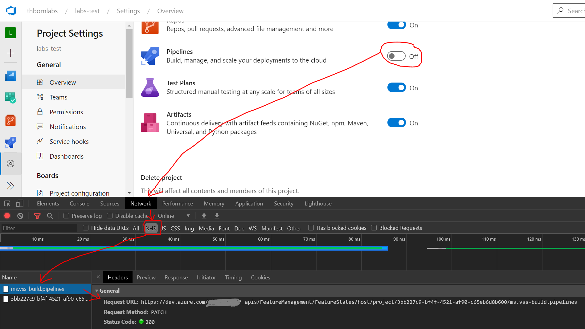

# Azure DevOps APIs

Nowadays, most of the worklaods are built using Rest API model. Azure DevOps is not different.

## How to identify the API using your browser tool

As an example I am using Microsoft EDGE with chromium engine. It is the same method on Google Chrome.

Let's say I want to verify the API that enables the "Pipeline" service, on Azure DevOps.

- First go to the Developer Tools on your browser by typing the keys all together **CTRL+SHIFT+I**
- Go to the Azure DevOps and then navigate to **"Project configuration"** -> **"Overview"**
- Then go to the **Network** tab
- Select the XHR option
- (Optional recommended) Clear the console there is a symbol on the right side of the **Record** (beside the red buttom)
- Now you can click on **Pipelines**
- The picture will help you a bit to localize where to find the **Url**



## Personal Access Token

For this play, I am using a Personal Access Token (PAT). Why PAT? Because it is easier to manage when you are automating things. It is easy do revoke access, or maybe I am lazy.

## The parameters.json file

Json files are awesome. Easy to manage, all the code languages have libraries to play with Json files. The variables are self explanatory.

```json
{
    "orgUrl": "https://dev.azure.com/YOUR_ORGANIZATION_HERE",
    "personalToken": "YOUR_PAT_HERE",
    "featureId": "3bb227c9-bf4f-4521-af90-c65eb6d8b600"
}
```

## How to generate the PAT

Please follow the link:
<https://docs.microsoft.com/en-us/azure/devops/organizations/accounts/use-personal-access-tokens-to-authenticate?view=azure-devops&tabs=preview-page>

## The Powershell Script

Invokes the API to disable the Test Labs from Azure DevOps.
